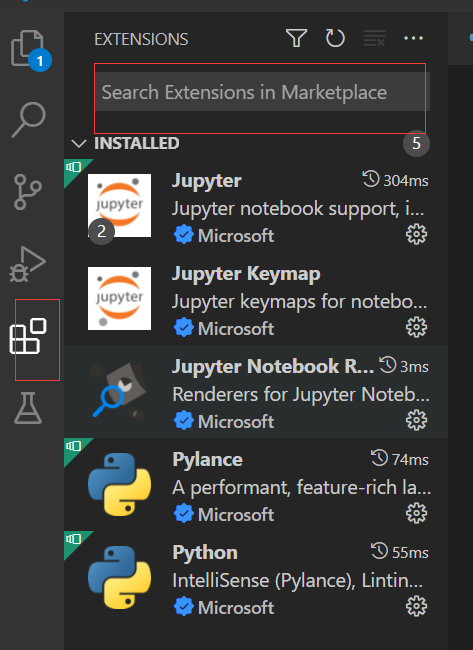
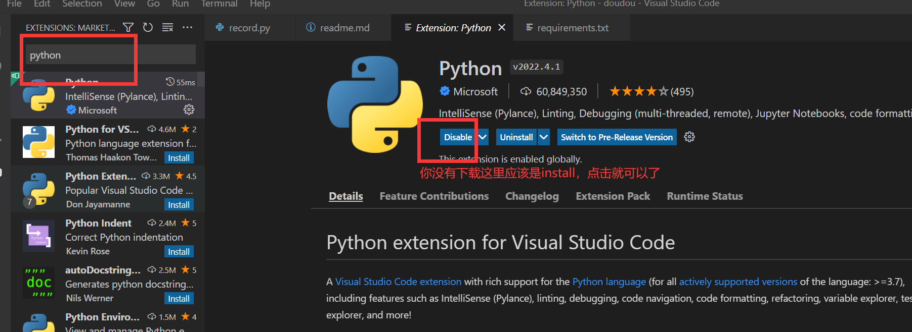

[toc]
# 各个文件的作用

`video` - 用来放视频

`cut` - 用来放视频每秒截取的图片以及图片识别的结果，每次运行都会清空一次再放新的

`imgs` - 放置模板图片（别动就行）

`excel.xls` - 放置数据的excel表格，每次运行一次都会覆盖新的数据

`record.py` - 主代码文件

# 运行介绍

## 下载python

[如何下载python](https://zhuanlan.zhihu.com/p/391102695)

## 下载vscode
百度一下你就知道

## 下载vscode的python扩展包
vscode左边的

## 安装环境
打开终端窗口：vscode菜单栏-Terminal-New Terminal
输入下列命令行后按回车：（国内用的清华镜像）

pip install -r requirements.txt -i https://pypi.tuna.tsinghua.edu.cn/simple

## 修改视频路径
打开record.py文件，把`video_path = "video\\000.mp4"`这里的路径改为自己的视频路径
## 运行代码
在终端运行 `python record.py`

# 代码功能介绍

此代码输入为拍摄数码管的视频，代码会每一秒钟从视频截屏，然后分析画面上的数字，最后将识别的数字记录在excel里，即一秒钟识别一次视频中的数字然后记录下来。

# 逻辑介绍

1. 读取模型文件图片，分析文件上的数字并将数据记录下来
2. 将视频每秒截图的图片放入`cut`目录中
3. 对于刚刚截图的文件遍历识别，每个图片将识别出的轮廓与刚刚模板分析中的数据对比，匹配数字
4. 最后将数据写入excel之中

# 不足

没有做有效区域的截取，这意味着这个代码只能匹配`video`目录下的demo视频，即整个画面就是数码管的视频，不能自动的找到画面中的数码管位置，如果输入的画面中有其他的东西，很可能造成干扰。
